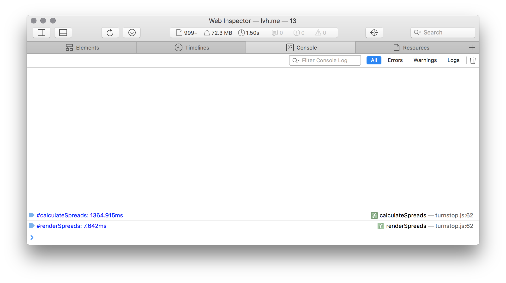

## console.time()

`console.time` и `console.timeEnd` замеряют и выводят время в миллисекундах, потраченное на выполнение кода:

```
console.time('#calculateSpreads')
spreads.forEach(function(spread) {
  spread.init();
});
console.timeEnd('#calculateSpreads')
```


