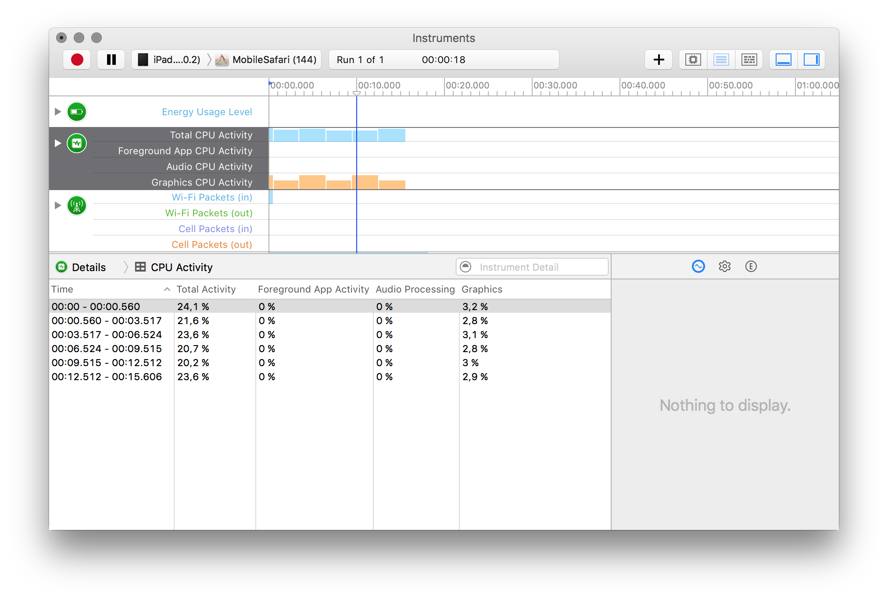

## Отслеживание потребляемой энергии на айпаде

Среди инструментов Икскода есть средства для мониторинга потребляемой энергии: Xcode — Instruments — Energy Diagnostics.

Пригодится, чтобы отслеживать влияние изменений в коде на энергопотребление приложения:

