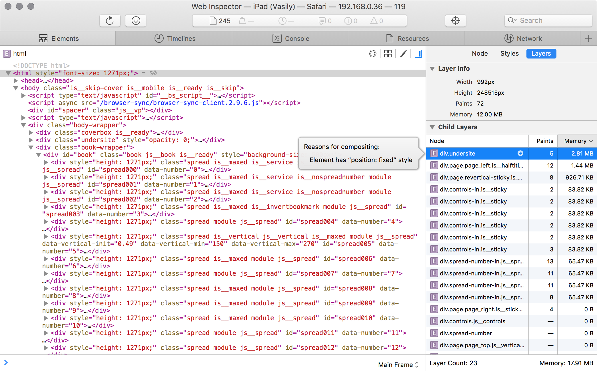

## Композитные слои в Веб-инспекторе

Композитный слой — поддерево ДОМ, отрисовываемое на ГПУ. Большое количество таких слоев становится проблемой на мобильных устройствах, из-за высокого потребления памяти.

Чтобы обнаружить все композитные слои и проследить за их отрисовкой на айпаде, откройте Веб-инспектор. Затем выделите `<html>` ноду — Layers — Child Layers:

